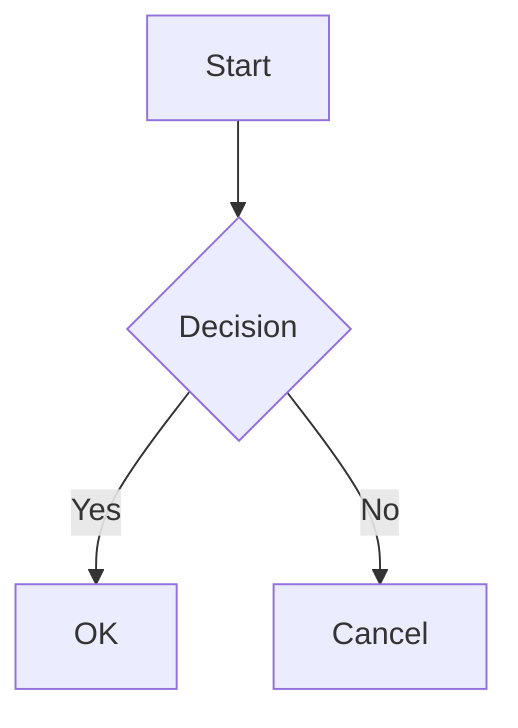

# Papyrus Implementation Plan

> **For agentic workers:** REQUIRED SUB-SKILL: Use superpowers:subagent-driven-development (recommended) or superpowers:executing-plans to implement this plan task-by-task. Steps use checkbox (`- [ ]`) syntax for tracking.

**Goal:** Typora 수준 렌더링 품질의 웹 기반 마크다운 에디터 + PDF 변환기 구현

**Architecture:** Next.js 단일 페이지 앱. CodeMirror 6 에디터 + unified 파이프라인으로 마크다운→HTML 변환 후 프리뷰 표시. PDF는 브라우저 print API로 생성. CSS 테마 시스템으로 프리뷰와 PDF에 동일 스타일 적용.

**Tech Stack:** Next.js 14 (App Router), CodeMirror 6, unified/remark/rehype, KaTeX, Shiki, Mermaid

---

### Task 1: Next.js 프로젝트 초기화

**Files:**
- Create: `package.json`
- Create: `next.config.ts`
- Create: `tsconfig.json`
- Create: `src/app/layout.tsx`
- Create: `src/app/page.tsx`
- Create: `src/app/globals.css`

- [ ] **Step 1: Next.js 프로젝트 생성**

```bash
cd /Users/twkk0/Desktop/Project/papyrus
npx create-next-app@latest . --typescript --tailwind --eslint --app --src-dir --import-alias "@/*" --use-npm
```

선택지가 나오면: TypeScript=Yes, ESLint=Yes, Tailwind=Yes, src/=Yes, App Router=Yes, import alias=@/*

- [ ] **Step 2: 불필요한 보일러플레이트 제거**

`src/app/page.tsx`를 최소화:

```tsx
export default function Home() {
  return <main className="h-screen">Papyrus</main>;
}
```

`src/app/globals.css`에서 Tailwind 기본만 남기기:

```css
@tailwind base;
@tailwind components;
@tailwind utilities;
```

- [ ] **Step 3: 개발 서버 실행 확인**

```bash
npm run dev
```

Expected: `http://localhost:3000`에서 "Papyrus" 텍스트 표시

- [ ] **Step 4: Git 초기화 및 커밋**

```bash
cd /Users/twkk0/Desktop/Project/papyrus
git init
git remote add origin https://github.com/TAEW00KIM/Papyrus.git
git add .
git commit -m "chore: init Next.js project"
```

---

### Task 2: 마크다운 처리 파이프라인

**Files:**
- Create: `src/lib/markdown.ts`
- Create: `src/lib/markdown.test.ts`

- [ ] **Step 1: 핵심 의존성 설치**

```bash
cd /Users/twkk0/Desktop/Project/papyrus
npm install unified remark-parse remark-gfm remark-math remark-rehype rehype-katex rehype-stringify rehype-slug rehype-autolink-headings shiki
```

- [ ] **Step 2: 테스트 환경 설치**

```bash
npm install -D vitest @testing-library/react @testing-library/jest-dom jsdom
```

`vitest.config.ts` 생성:

```ts
import { defineConfig } from "vitest/config";
import path from "path";

export default defineConfig({
  test: {
    environment: "jsdom",
  },
  resolve: {
    alias: {
      "@": path.resolve(__dirname, "./src"),
    },
  },
});
```

`package.json`에 스크립트 추가:

```json
"scripts": {
  "test": "vitest run",
  "test:watch": "vitest"
}
```

- [ ] **Step 3: 파이프라인 테스트 작성**

`src/lib/markdown.test.ts`:

```ts
import { describe, it, expect } from "vitest";
import { renderMarkdown } from "./markdown";

describe("renderMarkdown", () => {
  it("renders headings", async () => {
    const html = await renderMarkdown("# Hello");
    expect(html).toContain("<h1");
    expect(html).toContain("Hello");
  });

  it("renders GFM tables", async () => {
    const md = "| A | B |\n|---|---|\n| 1 | 2 |";
    const html = await renderMarkdown(md);
    expect(html).toContain("<table");
    expect(html).toContain("<td>1</td>");
  });

  it("renders math blocks", async () => {
    const html = await renderMarkdown("$$E = mc^2$$");
    expect(html).toContain("katex");
  });

  it("renders inline code", async () => {
    const html = await renderMarkdown("`const x = 1`");
    expect(html).toContain("<code");
  });

  it("renders checkboxes", async () => {
    const html = await renderMarkdown("- [x] done\n- [ ] todo");
    expect(html).toContain('type="checkbox"');
  });
});
```

- [ ] **Step 4: 테스트 실행 — 실패 확인**

```bash
npm test
```

Expected: FAIL — `renderMarkdown` 함수가 없음

- [ ] **Step 5: 파이프라인 구현**

`src/lib/markdown.ts`:

```ts
import { unified } from "unified";
import remarkParse from "remark-parse";
import remarkGfm from "remark-gfm";
import remarkMath from "remark-math";
import remarkRehype from "remark-rehype";
import rehypeKatex from "rehype-katex";
import rehypeSlug from "rehype-slug";
import rehypeAutolinkHeadings from "rehype-autolink-headings";
import rehypeStringify from "rehype-stringify";

const processor = unified()
  .use(remarkParse)
  .use(remarkGfm)
  .use(remarkMath)
  .use(remarkRehype, { allowDangerousHtml: true })
  .use(rehypeKatex)
  .use(rehypeSlug)
  .use(rehypeAutolinkHeadings, { behavior: "wrap" })
  .use(rehypeStringify, { allowDangerousHtml: true });

export async function renderMarkdown(markdown: string): Promise<string> {
  const result = await processor.process(markdown);
  return String(result);
}
```

참고: Shiki(코드 하이라이팅)는 Task 6에서 추가. Mermaid는 Task 7에서 추가.

- [ ] **Step 6: 테스트 실행 — 통과 확인**

```bash
npm test
```

Expected: 5 tests PASS

- [ ] **Step 7: 커밋**

```bash
git add src/lib/markdown.ts src/lib/markdown.test.ts vitest.config.ts package.json package-lock.json
git commit -m "feat: add markdown processing pipeline with unified"
```

---

### Task 3: CodeMirror 에디터 컴포넌트

**Files:**
- Create: `src/components/Editor.tsx`
- Create: `src/hooks/useCodeMirror.ts`

- [ ] **Step 1: CodeMirror 의존성 설치**

```bash
cd /Users/twkk0/Desktop/Project/papyrus
npm install @codemirror/view @codemirror/state @codemirror/lang-markdown @codemirror/language-data @codemirror/commands @codemirror/search
```

- [ ] **Step 2: CodeMirror 훅 구현**

`src/hooks/useCodeMirror.ts`:

```ts
"use client";

import { useEffect, useRef, useCallback } from "react";
import { EditorView, keymap, lineNumbers, highlightActiveLine } from "@codemirror/view";
import { EditorState } from "@codemirror/state";
import { markdown, markdownLanguage } from "@codemirror/lang-markdown";
import { languages } from "@codemirror/language-data";
import { defaultKeymap, history, historyKeymap } from "@codemirror/commands";
import { searchKeymap } from "@codemirror/search";

interface UseCodeMirrorProps {
  initialValue: string;
  onChange: (value: string) => void;
}

export function useCodeMirror({ initialValue, onChange }: UseCodeMirrorProps) {
  const containerRef = useRef<HTMLDivElement>(null);
  const viewRef = useRef<EditorView | null>(null);
  const onChangeRef = useRef(onChange);
  onChangeRef.current = onChange;

  useEffect(() => {
    if (!containerRef.current) return;

    const updateListener = EditorView.updateListener.of((update) => {
      if (update.docChanged) {
        onChangeRef.current(update.state.doc.toString());
      }
    });

    const state = EditorState.create({
      doc: initialValue,
      extensions: [
        lineNumbers(),
        highlightActiveLine(),
        history(),
        keymap.of([...defaultKeymap, ...historyKeymap, ...searchKeymap]),
        markdown({ base: markdownLanguage, codeLanguages: languages }),
        updateListener,
        EditorView.lineWrapping,
      ],
    });

    const view = new EditorView({
      state,
      parent: containerRef.current,
    });

    viewRef.current = view;

    return () => {
      view.destroy();
    };
  }, [initialValue]);

  const setValue = useCallback((value: string) => {
    const view = viewRef.current;
    if (!view) return;
    view.dispatch({
      changes: { from: 0, to: view.state.doc.length, insert: value },
    });
  }, []);

  return { containerRef, setValue };
}
```

- [ ] **Step 3: Editor 컴포넌트 구현**

`src/components/Editor.tsx`:

```tsx
"use client";

import { useCodeMirror } from "@/hooks/useCodeMirror";

interface EditorProps {
  initialValue: string;
  onChange: (value: string) => void;
}

export function Editor({ initialValue, onChange }: EditorProps) {
  const { containerRef } = useCodeMirror({ initialValue, onChange });

  return (
    <div
      ref={containerRef}
      className="h-full overflow-auto border-r border-gray-200"
    />
  );
}
```

- [ ] **Step 4: 페이지에 에디터 마운트하여 동작 확인**

`src/app/page.tsx`를 임시로 수정:

```tsx
"use client";

import { useState } from "react";
import { Editor } from "@/components/Editor";

const INITIAL_MD = `# Hello Papyrus

This is a **markdown** editor.

- Item 1
- Item 2
`;

export default function Home() {
  const [md, setMd] = useState(INITIAL_MD);

  return (
    <main className="h-screen flex flex-col">
      <div className="flex-1">
        <Editor initialValue={INITIAL_MD} onChange={setMd} />
      </div>
    </main>
  );
}
```

```bash
npm run dev
```

Expected: 브라우저에서 CodeMirror 에디터 표시, 마크다운 입력/편집 가능

- [ ] **Step 5: 커밋**

```bash
git add src/components/Editor.tsx src/hooks/useCodeMirror.ts src/app/page.tsx
git commit -m "feat: add CodeMirror 6 markdown editor"
```

---

### Task 4: 프리뷰 패널 + 좌우 분할 레이아웃

**Files:**
- Create: `src/components/Preview.tsx`
- Modify: `src/app/page.tsx`

- [ ] **Step 1: Preview 컴포넌트 구현**

`src/components/Preview.tsx`:

```tsx
"use client";

import { useEffect, useState, useRef } from "react";
import { renderMarkdown } from "@/lib/markdown";

interface PreviewProps {
  markdown: string;
  theme?: string;
}

export function Preview({ markdown: md, theme = "default" }: PreviewProps) {
  const [html, setHtml] = useState("");
  const containerRef = useRef<HTMLDivElement>(null);
  const timerRef = useRef<ReturnType<typeof setTimeout>>();

  useEffect(() => {
    clearTimeout(timerRef.current);
    timerRef.current = setTimeout(async () => {
      const result = await renderMarkdown(md);
      setHtml(result);
    }, 300);

    return () => clearTimeout(timerRef.current);
  }, [md]);

  return (
    <div
      ref={containerRef}
      className="h-full overflow-auto p-8 prose prose-neutral max-w-none"
      dangerouslySetInnerHTML={{ __html: html }}
    />
  );
}
```

- [ ] **Step 2: 좌우 분할 레이아웃 적용**

`src/app/page.tsx`:

```tsx
"use client";

import { useState } from "react";
import { Editor } from "@/components/Editor";
import { Preview } from "@/components/Preview";

const INITIAL_MD = `# Hello Papyrus

This is a **markdown** editor with live preview.

## Features

- GFM support (tables, checkboxes)
- Math: $E = mc^2$
- Code highlighting
- Mermaid diagrams

| Feature | Status |
|---------|--------|
| Editor  | Done   |
| Preview | Done   |

\`\`\`javascript
function hello() {
  console.log("Hello, Papyrus!");
}
\`\`\`
`;

export default function Home() {
  const [md, setMd] = useState(INITIAL_MD);

  return (
    <main className="h-screen flex flex-col bg-white">
      <div className="flex-1 flex min-h-0">
        <div className="w-1/2 min-h-0">
          <Editor initialValue={INITIAL_MD} onChange={setMd} />
        </div>
        <div className="w-1/2 min-h-0 border-l border-gray-200">
          <Preview markdown={md} />
        </div>
      </div>
    </main>
  );
}
```

- [ ] **Step 3: 브라우저에서 확인**

```bash
npm run dev
```

Expected: 좌측 에디터, 우측 프리뷰. 에디터 입력 시 300ms 후 프리뷰 업데이트.

- [ ] **Step 4: 커밋**

```bash
git add src/components/Preview.tsx src/app/page.tsx
git commit -m "feat: add preview panel with split layout"
```

---

### Task 5: 툴바 + 상태바 UI

**Files:**
- Create: `src/components/Toolbar.tsx`
- Create: `src/components/StatusBar.tsx`
- Modify: `src/app/page.tsx`

- [ ] **Step 1: Toolbar 컴포넌트**

`src/components/Toolbar.tsx`:

```tsx
"use client";

import { useRef } from "react";

interface ToolbarProps {
  onFileUpload: (content: string) => void;
  onExportPdf: () => void;
  currentTheme: string;
  onThemeChange: (theme: string) => void;
}

const THEMES = [
  { id: "default", label: "Default" },
  { id: "academic", label: "Academic" },
  { id: "minimal", label: "Minimal" },
];

export function Toolbar({
  onFileUpload,
  onExportPdf,
  currentTheme,
  onThemeChange,
}: ToolbarProps) {
  const fileInputRef = useRef<HTMLInputElement>(null);

  const handleFileChange = (e: React.ChangeEvent<HTMLInputElement>) => {
    const file = e.target.files?.[0];
    if (!file) return;
    const reader = new FileReader();
    reader.onload = () => {
      onFileUpload(reader.result as string);
    };
    reader.readAsText(file);
    e.target.value = "";
  };

  return (
    <header className="flex items-center justify-between px-6 py-3 border-b border-gray-200 bg-white">
      <div className="flex items-center gap-2">
        <span className="text-lg font-semibold tracking-tight text-black">
          Papyrus
        </span>
      </div>

      <div className="flex items-center gap-3">
        <input
          ref={fileInputRef}
          type="file"
          accept=".md,.markdown,.txt"
          onChange={handleFileChange}
          className="hidden"
        />
        <button
          onClick={() => fileInputRef.current?.click()}
          className="px-4 py-2 text-sm font-medium text-gray-700 bg-gray-100 rounded-xl hover:bg-gray-200 transition-colors"
        >
          파일 업로드
        </button>

        <select
          value={currentTheme}
          onChange={(e) => onThemeChange(e.target.value)}
          className="px-4 py-2 text-sm font-medium text-gray-700 bg-gray-100 rounded-xl hover:bg-gray-200 transition-colors appearance-none cursor-pointer"
        >
          {THEMES.map((t) => (
            <option key={t.id} value={t.id}>
              {t.label}
            </option>
          ))}
        </select>

        <button
          onClick={onExportPdf}
          className="px-4 py-2 text-sm font-medium text-white bg-black rounded-xl hover:bg-gray-800 transition-colors"
        >
          PDF 내보내기
        </button>
      </div>
    </header>
  );
}
```

- [ ] **Step 2: StatusBar 컴포넌트**

`src/components/StatusBar.tsx`:

```tsx
"use client";

import { useMemo } from "react";

interface StatusBarProps {
  markdown: string;
}

export function StatusBar({ markdown }: StatusBarProps) {
  const stats = useMemo(() => {
    const chars = markdown.length;
    const words = markdown.trim() ? markdown.trim().split(/\s+/).length : 0;
    const readingTime = Math.max(1, Math.ceil(words / 200));
    return { chars, words, readingTime };
  }, [markdown]);

  return (
    <footer className="flex items-center gap-4 px-6 py-2 border-t border-gray-200 bg-white text-xs text-gray-500">
      <span>{stats.chars.toLocaleString()} 글자</span>
      <span>{stats.words.toLocaleString()} 단어</span>
      <span>약 {stats.readingTime}분 읽기</span>
    </footer>
  );
}
```

- [ ] **Step 3: page.tsx에 통합**

`src/app/page.tsx`:

```tsx
"use client";

import { useState, useCallback } from "react";
import { Editor } from "@/components/Editor";
import { Preview } from "@/components/Preview";
import { Toolbar } from "@/components/Toolbar";
import { StatusBar } from "@/components/StatusBar";

const INITIAL_MD = `# Hello Papyrus

This is a **markdown** editor with live preview.

## Features

- GFM support (tables, checkboxes)
- Math: $E = mc^2$
- Code highlighting
- Mermaid diagrams

| Feature | Status |
|---------|--------|
| Editor  | Done   |
| Preview | Done   |

\`\`\`javascript
function hello() {
  console.log("Hello, Papyrus!");
}
\`\`\`
`;

export default function Home() {
  const [md, setMd] = useState(INITIAL_MD);
  const [theme, setTheme] = useState("default");
  const [fileLoadKey, setFileLoadKey] = useState(0);
  const [loadedContent, setLoadedContent] = useState(INITIAL_MD);

  const handleFileUpload = useCallback((content: string) => {
    setMd(content);
    setLoadedContent(content);
    setFileLoadKey((k) => k + 1);
  }, []);

  const handleExportPdf = useCallback(() => {
    // Task 8에서 구현
  }, []);

  return (
    <main className="h-screen flex flex-col bg-white">
      <Toolbar
        onFileUpload={handleFileUpload}
        onExportPdf={handleExportPdf}
        currentTheme={theme}
        onThemeChange={setTheme}
      />
      <div className="flex-1 flex min-h-0">
        <div className="w-1/2 min-h-0">
          <Editor
            key={fileLoadKey}
            initialValue={loadedContent}
            onChange={setMd}
          />
        </div>
        <div className="w-1/2 min-h-0 border-l border-gray-200">
          <Preview markdown={md} theme={theme} />
        </div>
      </div>
      <StatusBar markdown={md} />
    </main>
  );
}
```

- [ ] **Step 4: 브라우저에서 확인**

```bash
npm run dev
```

Expected: 상단 툴바(로고, 업로드, 테마, PDF 버튼) + 하단 상태바(글자 수, 단어 수, 읽기 시간) 표시. 파일 업로드 시 에디터에 내용 로드.

- [ ] **Step 5: 커밋**

```bash
git add src/components/Toolbar.tsx src/components/StatusBar.tsx src/app/page.tsx
git commit -m "feat: add toolbar and status bar UI"
```

---

### Task 6: Shiki 코드 하이라이팅

**Files:**
- Create: `src/lib/shiki.ts`
- Modify: `src/lib/markdown.ts`
- Modify: `src/lib/markdown.test.ts`

- [ ] **Step 1: 테스트 추가**

`src/lib/markdown.test.ts`에 추가:

```ts
it("renders code blocks with syntax highlighting", async () => {
  const md = '```javascript\nconst x = 1;\n```';
  const html = await renderMarkdown(md);
  expect(html).toContain("shiki");
});
```

- [ ] **Step 2: 테스트 실행 — 실패 확인**

```bash
npm test
```

Expected: 새 테스트 FAIL (shiki 클래스 미포함)

- [ ] **Step 3: Shiki 통합 구현**

`src/lib/shiki.ts`:

```ts
import { createHighlighter, type Highlighter } from "shiki";

let highlighter: Highlighter | null = null;

export async function getHighlighter(): Promise<Highlighter> {
  if (!highlighter) {
    highlighter = await createHighlighter({
      themes: ["github-light"],
      langs: ["javascript", "typescript", "python", "java", "go", "rust", "bash", "json", "html", "css", "sql", "yaml", "markdown"],
    });
  }
  return highlighter;
}
```

`src/lib/markdown.ts` 수정 — Shiki를 rehype 플러그인으로 통합:

```ts
import { unified } from "unified";
import remarkParse from "remark-parse";
import remarkGfm from "remark-gfm";
import remarkMath from "remark-math";
import remarkRehype from "remark-rehype";
import rehypeKatex from "rehype-katex";
import rehypeSlug from "rehype-slug";
import rehypeAutolinkHeadings from "rehype-autolink-headings";
import rehypeStringify from "rehype-stringify";
import { getHighlighter } from "./shiki";
import type { Root, Element, Text } from "hast";
import { visit } from "unist-util-visit";

function rehypeShiki() {
  return async (tree: Root) => {
    const highlighter = await getHighlighter();
    const nodes: { node: Element; lang: string; code: string }[] = [];

    visit(tree, "element", (node: Element) => {
      if (
        node.tagName === "pre" &&
        node.children[0] &&
        (node.children[0] as Element).tagName === "code"
      ) {
        const codeNode = node.children[0] as Element;
        const className = (codeNode.properties?.className as string[]) || [];
        const lang = className
          .find((c) => c.startsWith("language-"))
          ?.replace("language-", "") || "text";
        const code = (codeNode.children[0] as Text)?.value || "";
        nodes.push({ node, lang, code });
      }
    });

    for (const { node, lang, code } of nodes) {
      try {
        const html = highlighter.codeToHtml(code, {
          lang,
          theme: "github-light",
        });
        node.tagName = "div";
        node.properties = { className: ["shiki-wrapper"] };
        node.children = [{ type: "raw", value: html } as unknown as Element];
      } catch {
        // 지원하지 않는 언어는 기본 <pre> 유지
      }
    }
  };
}

export async function renderMarkdown(markdown: string): Promise<string> {
  const result = await unified()
    .use(remarkParse)
    .use(remarkGfm)
    .use(remarkMath)
    .use(remarkRehype, { allowDangerousHtml: true })
    .use(rehypeKatex)
    .use(rehypeShiki)
    .use(rehypeSlug)
    .use(rehypeAutolinkHeadings, { behavior: "wrap" })
    .use(rehypeStringify, { allowDangerousHtml: true, allowDangerousCharacters: true })
    .process(markdown);

  return String(result);
}
```

참고: 프로세서를 매번 생성하는 이유는 rehypeShiki가 async이기 때문. Shiki highlighter 인스턴스 자체는 싱글턴으로 캐싱됨.

- [ ] **Step 4: unist-util-visit 설치**

```bash
npm install unist-util-visit
```

- [ ] **Step 5: 테스트 실행 — 통과 확인**

```bash
npm test
```

Expected: 모든 테스트 PASS

- [ ] **Step 6: 커밋**

```bash
git add src/lib/shiki.ts src/lib/markdown.ts src/lib/markdown.test.ts package.json package-lock.json
git commit -m "feat: add Shiki code syntax highlighting"
```

---

### Task 7: Mermaid 다이어그램 렌더링

**Files:**
- Create: `src/components/MermaidRenderer.tsx`
- Modify: `src/components/Preview.tsx`

- [ ] **Step 1: Mermaid 설치**

```bash
cd /Users/twkk0/Desktop/Project/papyrus
npm install mermaid
```

- [ ] **Step 2: MermaidRenderer 컴포넌트 구현**

`src/components/MermaidRenderer.tsx`:

```tsx
"use client";

import { useEffect, useRef, useState } from "react";

interface MermaidRendererProps {
  chart: string;
}

export function MermaidRenderer({ chart }: MermaidRendererProps) {
  const containerRef = useRef<HTMLDivElement>(null);
  const [svg, setSvg] = useState("");
  const [error, setError] = useState("");

  useEffect(() => {
    let cancelled = false;

    (async () => {
      try {
        const mermaid = (await import("mermaid")).default;
        mermaid.initialize({
          startOnLoad: false,
          theme: "neutral",
          securityLevel: "loose",
        });
        const id = `mermaid-${Math.random().toString(36).slice(2)}`;
        const { svg: rendered } = await mermaid.render(id, chart);
        if (!cancelled) {
          setSvg(rendered);
          setError("");
        }
      } catch (e) {
        if (!cancelled) {
          setError("Mermaid 렌더링 실패");
          setSvg("");
        }
      }
    })();

    return () => {
      cancelled = true;
    };
  }, [chart]);

  if (error) {
    return <pre className="text-red-500 text-sm p-2">{error}</pre>;
  }

  return <div ref={containerRef} dangerouslySetInnerHTML={{ __html: svg }} />;
}
```

- [ ] **Step 3: Preview에 Mermaid 통합**

`src/components/Preview.tsx` 수정:

```tsx
"use client";

import { useEffect, useState, useRef, useMemo } from "react";
import { renderMarkdown } from "@/lib/markdown";
import { MermaidRenderer } from "./MermaidRenderer";

interface PreviewProps {
  markdown: string;
  theme?: string;
}

function extractMermaidBlocks(md: string): { cleaned: string; blocks: Map<string, string> } {
  const blocks = new Map<string, string>();
  let counter = 0;
  const cleaned = md.replace(/```mermaid\n([\s\S]*?)```/g, (_, code) => {
    const id = `__MERMAID_${counter++}__`;
    blocks.set(id, code.trim());
    return `<div data-mermaid-id="${id}"></div>`;
  });
  return { cleaned, blocks };
}

export function Preview({ markdown: md, theme = "default" }: PreviewProps) {
  const [html, setHtml] = useState("");
  const containerRef = useRef<HTMLDivElement>(null);
  const timerRef = useRef<ReturnType<typeof setTimeout>>();

  const { cleaned, blocks: mermaidBlocks } = useMemo(() => extractMermaidBlocks(md), [md]);

  useEffect(() => {
    clearTimeout(timerRef.current);
    timerRef.current = setTimeout(async () => {
      const result = await renderMarkdown(cleaned);
      setHtml(result);
    }, 300);

    return () => clearTimeout(timerRef.current);
  }, [cleaned]);

  return (
    <div ref={containerRef} className="h-full overflow-auto p-8">
      <div className="prose prose-neutral max-w-none">
        {html.split(/(<div data-mermaid-id="__MERMAID_\d+__"><\/div>)/).map((part, i) => {
          const match = part.match(/data-mermaid-id="(__MERMAID_\d+__)"/);
          if (match && mermaidBlocks.has(match[1])) {
            return <MermaidRenderer key={match[1]} chart={mermaidBlocks.get(match[1])!} />;
          }
          return <div key={i} dangerouslySetInnerHTML={{ __html: part }} />;
        })}
      </div>
    </div>
  );
}
```

- [ ] **Step 4: 브라우저에서 Mermaid 다이어그램 확인**

에디터에 입력:

````

````

Expected: 프리뷰에 Mermaid 다이어그램 SVG 렌더링

- [ ] **Step 5: 커밋**

```bash
git add src/components/MermaidRenderer.tsx src/components/Preview.tsx package.json package-lock.json
git commit -m "feat: add Mermaid diagram rendering"
```

---

### Task 8: PDF 내보내기

**Files:**
- Create: `src/lib/pdf.ts`
- Create: `src/styles/print.css`
- Modify: `src/app/page.tsx`

- [ ] **Step 1: print CSS 작성**

`src/styles/print.css`:

```css
@media print {
  @page {
    size: A4;
    margin: 2cm;
  }

  body {
    font-family: 'Pretendard', sans-serif;
    font-size: 16px;
    line-height: 1.75;
    color: #222;
  }

  h1, h2, h3, h4, h5, h6 {
    color: #111;
    break-after: avoid;
  }

  pre, code, table, figure, img {
    break-inside: avoid;
  }

  a {
    color: #000;
    text-decoration: underline;
  }

  img {
    max-width: 100%;
  }

  .shiki-wrapper pre {
    border: 1px solid #e5e5e5;
    border-radius: 8px;
    padding: 1em;
  }

  table {
    border-collapse: collapse;
    width: 100%;
  }

  th, td {
    border: 1px solid #ddd;
    padding: 8px 12px;
    text-align: left;
  }

  th {
    background-color: #f5f5f5;
    font-weight: 600;
  }
}
```

- [ ] **Step 2: PDF 생성 함수 구현**

`src/lib/pdf.ts`:

```ts
import printCss from "@/styles/print.css?raw";

interface PdfOptions {
  title?: string;
  themeCSS?: string;
}

export function exportPdf(html: string, options: PdfOptions = {}) {
  const { title = "Papyrus Document", themeCSS = "" } = options;

  const iframe = document.createElement("iframe");
  iframe.style.position = "fixed";
  iframe.style.left = "-9999px";
  iframe.style.top = "-9999px";
  iframe.style.width = "210mm";
  iframe.style.height = "297mm";
  document.body.appendChild(iframe);

  const doc = iframe.contentDocument!;
  doc.open();
  doc.write(`
    <!DOCTYPE html>
    <html>
    <head>
      <meta charset="utf-8">
      <title>${title}</title>
      <link rel="stylesheet" href="https://cdn.jsdelivr.net/npm/katex@0.16.11/dist/katex.min.css">
      <link rel="preconnect" href="https://cdn.jsdelivr.net">
      <style>${printCss}</style>
      <style>${themeCSS}</style>
      <style>
        body {
          font-family: 'Pretendard', -apple-system, BlinkMacSystemFont, sans-serif;
          line-height: 1.75;
          color: #222;
          padding: 0;
          margin: 0;
        }
        .content {
          max-width: 100%;
        }
      </style>
    </head>
    <body>
      <div class="content">${html}</div>
    </body>
    </html>
  `);
  doc.close();

  // 이미지/폰트 로드 후 print
  iframe.contentWindow!.onafterprint = () => {
    document.body.removeChild(iframe);
  };

  setTimeout(() => {
    iframe.contentWindow!.print();
    // fallback: onafterprint가 안 먹는 브라우저
    setTimeout(() => {
      if (iframe.parentNode) {
        document.body.removeChild(iframe);
      }
    }, 1000);
  }, 500);
}
```

- [ ] **Step 3: page.tsx에 PDF 내보내기 연결**

`src/app/page.tsx`에서 `handleExportPdf` 수정:

```tsx
const handleExportPdf = useCallback(async () => {
  const { exportPdf } = await import("@/lib/pdf");
  const { renderMarkdown } = await import("@/lib/markdown");
  const html = await renderMarkdown(md);
  exportPdf(html);
}, [md]);
```

- [ ] **Step 4: 브라우저에서 PDF 내보내기 테스트**

```bash
npm run dev
```

에디터에 마크다운 작성 후 "PDF 내보내기" 클릭.
Expected: 브라우저 PDF 저장 다이얼로그 표시, 깔끔한 A4 PDF 출력.

- [ ] **Step 5: 커밋**

```bash
git add src/lib/pdf.ts src/styles/print.css src/app/page.tsx
git commit -m "feat: add PDF export via browser print API"
```

---

### Task 9: 테마 엔진

**Files:**
- Create: `src/styles/themes/default.css`
- Create: `src/styles/themes/academic.css`
- Create: `src/styles/themes/minimal.css`
- Create: `src/lib/themes.ts`
- Modify: `src/components/Preview.tsx`
- Modify: `src/app/page.tsx`
- Modify: `src/app/layout.tsx`

- [ ] **Step 1: 기본 테마 CSS 작성**

`src/styles/themes/default.css`:

```css
.theme-default {
  --font-body: 'Pretendard', -apple-system, BlinkMacSystemFont, sans-serif;
  --font-code: 'JetBrains Mono', 'Fira Code', monospace;
  --font-size: 16px;
  --line-height: 1.75;
  --color-text: #222;
  --color-heading: #111;
  --color-link: #000;
  --color-code-bg: #f5f5f5;
  --color-border: #e5e5e5;
  --color-table-header: #f5f5f5;
}

.theme-default {
  font-family: var(--font-body);
  font-size: var(--font-size);
  line-height: var(--line-height);
  color: var(--color-text);
}

.theme-default h1,
.theme-default h2,
.theme-default h3,
.theme-default h4,
.theme-default h5,
.theme-default h6 {
  color: var(--color-heading);
  font-weight: 700;
  margin-top: 1.5em;
  margin-bottom: 0.5em;
}

.theme-default h1 { font-size: 2em; border-bottom: 1px solid var(--color-border); padding-bottom: 0.3em; }
.theme-default h2 { font-size: 1.5em; border-bottom: 1px solid var(--color-border); padding-bottom: 0.3em; }
.theme-default h3 { font-size: 1.25em; }

.theme-default a { color: var(--color-link); text-decoration: underline; }

.theme-default code {
  font-family: var(--font-code);
  background: var(--color-code-bg);
  padding: 0.2em 0.4em;
  border-radius: 4px;
  font-size: 0.9em;
}

.theme-default pre {
  background: var(--color-code-bg);
  border-radius: 8px;
  padding: 1em;
  overflow-x: auto;
}

.theme-default pre code {
  background: none;
  padding: 0;
}

.theme-default blockquote {
  border-left: 4px solid var(--color-border);
  margin-left: 0;
  padding-left: 1em;
  color: #555;
}

.theme-default table {
  border-collapse: collapse;
  width: 100%;
  margin: 1em 0;
}

.theme-default th,
.theme-default td {
  border: 1px solid var(--color-border);
  padding: 8px 12px;
  text-align: left;
}

.theme-default th {
  background: var(--color-table-header);
  font-weight: 600;
}

.theme-default img {
  max-width: 100%;
  border-radius: 8px;
}

.theme-default hr {
  border: none;
  border-top: 1px solid var(--color-border);
  margin: 2em 0;
}
```

- [ ] **Step 2: Academic 테마**

`src/styles/themes/academic.css`:

```css
.theme-academic {
  --font-body: 'Georgia', 'Times New Roman', serif;
  --font-code: 'JetBrains Mono', monospace;
  --font-size: 14px;
  --line-height: 1.8;
  --color-text: #1a1a1a;
  --color-heading: #000;
  --color-link: #000;
  --color-code-bg: #f8f8f8;
  --color-border: #ccc;
  --color-table-header: #f0f0f0;
}

.theme-academic {
  font-family: var(--font-body);
  font-size: var(--font-size);
  line-height: var(--line-height);
  color: var(--color-text);
  max-width: 680px;
  margin: 0 auto;
}

.theme-academic h1 { font-size: 1.8em; text-align: center; margin-bottom: 0.2em; }
.theme-academic h2 { font-size: 1.4em; margin-top: 2em; }
.theme-academic h3 { font-size: 1.2em; }

.theme-academic h1,
.theme-academic h2,
.theme-academic h3 {
  color: var(--color-heading);
  font-weight: 700;
}

.theme-academic a { color: var(--color-link); }
.theme-academic code {
  font-family: var(--font-code);
  background: var(--color-code-bg);
  padding: 0.15em 0.3em;
  border-radius: 3px;
  font-size: 0.85em;
}
.theme-academic pre {
  background: var(--color-code-bg);
  border: 1px solid var(--color-border);
  border-radius: 4px;
  padding: 0.8em;
  overflow-x: auto;
}
.theme-academic pre code { background: none; padding: 0; }
.theme-academic blockquote {
  border-left: 3px solid var(--color-border);
  margin-left: 0;
  padding-left: 1em;
  font-style: italic;
  color: #444;
}
.theme-academic table { border-collapse: collapse; width: 100%; margin: 1em 0; }
.theme-academic th, .theme-academic td { border: 1px solid var(--color-border); padding: 6px 10px; }
.theme-academic th { background: var(--color-table-header); font-weight: 600; }
.theme-academic img { max-width: 100%; }
.theme-academic hr { border: none; border-top: 1px solid var(--color-border); margin: 2em 0; }
```

- [ ] **Step 3: Minimal 테마**

`src/styles/themes/minimal.css`:

```css
.theme-minimal {
  --font-body: 'Pretendard', -apple-system, sans-serif;
  --font-code: 'SF Mono', 'Menlo', monospace;
  --font-size: 15px;
  --line-height: 1.7;
  --color-text: #333;
  --color-heading: #000;
  --color-link: #000;
  --color-code-bg: #fafafa;
  --color-border: #eee;
  --color-table-header: #fafafa;
}

.theme-minimal {
  font-family: var(--font-body);
  font-size: var(--font-size);
  line-height: var(--line-height);
  color: var(--color-text);
}

.theme-minimal h1 { font-size: 1.6em; font-weight: 800; letter-spacing: -0.02em; }
.theme-minimal h2 { font-size: 1.3em; font-weight: 700; }
.theme-minimal h3 { font-size: 1.1em; font-weight: 600; }

.theme-minimal h1,
.theme-minimal h2,
.theme-minimal h3 {
  color: var(--color-heading);
  margin-top: 2em;
  margin-bottom: 0.5em;
}

.theme-minimal a { color: var(--color-link); text-decoration: none; border-bottom: 1px solid #ccc; }
.theme-minimal a:hover { border-bottom-color: #000; }
.theme-minimal code {
  font-family: var(--font-code);
  background: var(--color-code-bg);
  padding: 0.15em 0.35em;
  border-radius: 3px;
  font-size: 0.88em;
}
.theme-minimal pre {
  background: var(--color-code-bg);
  border-radius: 6px;
  padding: 1em;
  overflow-x: auto;
}
.theme-minimal pre code { background: none; padding: 0; }
.theme-minimal blockquote {
  border-left: 2px solid #ddd;
  margin-left: 0;
  padding-left: 1em;
  color: #666;
}
.theme-minimal table { border-collapse: collapse; width: 100%; margin: 1em 0; }
.theme-minimal th, .theme-minimal td { border-bottom: 1px solid var(--color-border); padding: 8px 12px; }
.theme-minimal th { font-weight: 600; text-align: left; }
.theme-minimal img { max-width: 100%; border-radius: 4px; }
.theme-minimal hr { border: none; border-top: 1px solid var(--color-border); margin: 2em 0; }
```

- [ ] **Step 4: 테마 관리 모듈**

`src/lib/themes.ts`:

```ts
import defaultTheme from "@/styles/themes/default.css?raw";
import academicTheme from "@/styles/themes/academic.css?raw";
import minimalTheme from "@/styles/themes/minimal.css?raw";

export const THEMES = {
  default: { label: "Default", css: defaultTheme, className: "theme-default" },
  academic: { label: "Academic", css: academicTheme, className: "theme-academic" },
  minimal: { label: "Minimal", css: minimalTheme, className: "theme-minimal" },
} as const;

export type ThemeId = keyof typeof THEMES;

export function getThemeCSS(id: ThemeId): string {
  return THEMES[id].css;
}

export function getThemeClassName(id: ThemeId): string {
  return THEMES[id].className;
}
```

- [ ] **Step 5: Preview에 테마 클래스 적용**

`src/components/Preview.tsx`의 prose div에 테마 클래스 추가:

```tsx
import { getThemeClassName, type ThemeId } from "@/lib/themes";

// PreviewProps의 theme 타입 변경
interface PreviewProps {
  markdown: string;
  theme?: ThemeId;
}

// 렌더링 부분에서 className에 테마 반영
const themeClass = getThemeClassName(theme as ThemeId);

// JSX에서:
<div className={`prose prose-neutral max-w-none ${themeClass}`}>
```

- [ ] **Step 6: layout.tsx에 폰트 CDN 추가**

`src/app/layout.tsx`에 Pretendard와 JetBrains Mono CDN 링크 추가:

```tsx
import type { Metadata } from "next";
import "./globals.css";

export const metadata: Metadata = {
  title: "Papyrus",
  description: "Beautiful markdown to PDF converter",
};

export default function RootLayout({
  children,
}: Readonly<{
  children: React.ReactNode;
}>) {
  return (
    <html lang="ko">
      <head>
        <link
          rel="stylesheet"
          href="https://cdn.jsdelivr.net/gh/orioncactus/pretendard@v1.3.9/dist/web/variable/pretendardvariable.min.css"
        />
        <link
          rel="stylesheet"
          href="https://fonts.googleapis.com/css2?family=JetBrains+Mono:wght@400;700&display=swap"
        />
        <link
          rel="stylesheet"
          href="https://cdn.jsdelivr.net/npm/katex@0.16.11/dist/katex.min.css"
        />
      </head>
      <body className="antialiased">{children}</body>
    </html>
  );
}
```

- [ ] **Step 7: PDF 내보내기에 테마 CSS 전달**

`src/app/page.tsx`의 `handleExportPdf`에서 테마 CSS 전달:

```tsx
const handleExportPdf = useCallback(async () => {
  const { exportPdf } = await import("@/lib/pdf");
  const { renderMarkdown } = await import("@/lib/markdown");
  const { getThemeCSS, getThemeClassName } = await import("@/lib/themes");
  const html = await renderMarkdown(md);
  const themeCSS = getThemeCSS(theme as any);
  const themeClass = getThemeClassName(theme as any);
  exportPdf(`<div class="${themeClass}">${html}</div>`, { themeCSS });
}, [md, theme]);
```

- [ ] **Step 8: 브라우저에서 테마 전환 확인**

```bash
npm run dev
```

Expected: 테마 드롭다운에서 Default/Academic/Minimal 전환 시 프리뷰 스타일 즉시 변경.

- [ ] **Step 9: 커밋**

```bash
git add src/styles/themes/ src/lib/themes.ts src/components/Preview.tsx src/app/layout.tsx src/app/page.tsx
git commit -m "feat: add theme engine with 3 built-in themes"
```

---

### Task 10: 스크롤 동기화

**Files:**
- Modify: `src/hooks/useCodeMirror.ts`
- Modify: `src/components/Preview.tsx`
- Modify: `src/app/page.tsx`

- [ ] **Step 1: 에디터에서 스크롤 비율 콜백 추가**

`src/hooks/useCodeMirror.ts`에 `onScroll` 콜백 추가:

```ts
interface UseCodeMirrorProps {
  initialValue: string;
  onChange: (value: string) => void;
  onScroll?: (ratio: number) => void;
}

// useEffect 내부에서 scrollDOM에 이벤트 리스너 추가:
const scrollHandler = () => {
  const dom = view.scrollDOM;
  const ratio = dom.scrollTop / (dom.scrollHeight - dom.clientHeight || 1);
  onScrollRef.current?.(ratio);
};

view.scrollDOM.addEventListener("scroll", scrollHandler);

// cleanup에 추가:
return () => {
  view.scrollDOM.removeEventListener("scroll", scrollHandler);
  view.destroy();
};
```

- [ ] **Step 2: Preview에 스크롤 제어 ref 노출**

`src/components/Preview.tsx`에 `scrollRatio` prop 추가:

```tsx
interface PreviewProps {
  markdown: string;
  theme?: ThemeId;
  scrollRatio?: number;
}

// useEffect로 스크롤 동기화:
useEffect(() => {
  if (scrollRatio == null || !containerRef.current) return;
  const el = containerRef.current;
  el.scrollTop = scrollRatio * (el.scrollHeight - el.clientHeight);
}, [scrollRatio]);
```

- [ ] **Step 3: page.tsx에서 연결**

```tsx
const [scrollRatio, setScrollRatio] = useState(0);

// Editor에 onScroll 전달, Preview에 scrollRatio 전달
<Editor initialValue={loadedContent} onChange={setMd} onScroll={setScrollRatio} />
<Preview markdown={md} theme={theme} scrollRatio={scrollRatio} />
```

- [ ] **Step 4: 브라우저에서 동기화 확인**

긴 마크다운 입력 후 에디터 스크롤 시 프리뷰도 따라감.

- [ ] **Step 5: 커밋**

```bash
git add src/hooks/useCodeMirror.ts src/components/Preview.tsx src/app/page.tsx
git commit -m "feat: add editor-preview scroll sync"
```

---

### Task 11: 파일 드래그앤드롭 + localStorage 자동 저장

**Files:**
- Modify: `src/app/page.tsx`

- [ ] **Step 1: 드래그앤드롭 핸들러 추가**

`src/app/page.tsx`에 추가:

```tsx
const handleDrop = useCallback((e: React.DragEvent) => {
  e.preventDefault();
  const file = e.dataTransfer.files[0];
  if (!file || !file.name.match(/\.(md|markdown|txt)$/)) return;
  const reader = new FileReader();
  reader.onload = () => {
    handleFileUpload(reader.result as string);
  };
  reader.readAsText(file);
}, [handleFileUpload]);

const handleDragOver = useCallback((e: React.DragEvent) => {
  e.preventDefault();
}, []);

// main에 적용:
<main
  className="h-screen flex flex-col bg-white"
  onDrop={handleDrop}
  onDragOver={handleDragOver}
>
```

- [ ] **Step 2: localStorage 자동 저장/복원**

```tsx
const STORAGE_KEY = "papyrus-content";

// 초기값을 localStorage에서 로드:
const [md, setMd] = useState(() => {
  if (typeof window === "undefined") return INITIAL_MD;
  return localStorage.getItem(STORAGE_KEY) || INITIAL_MD;
});
const [loadedContent, setLoadedContent] = useState(() => {
  if (typeof window === "undefined") return INITIAL_MD;
  return localStorage.getItem(STORAGE_KEY) || INITIAL_MD;
});

// 변경 시 저장 (debounce):
useEffect(() => {
  const timer = setTimeout(() => {
    localStorage.setItem(STORAGE_KEY, md);
  }, 1000);
  return () => clearTimeout(timer);
}, [md]);
```

- [ ] **Step 3: 브라우저에서 확인**

1. 마크다운 입력 후 새로고침 → 내용 유지
2. .md 파일을 브라우저에 드래그 → 에디터에 내용 로드

- [ ] **Step 4: 커밋**

```bash
git add src/app/page.tsx
git commit -m "feat: add drag-and-drop upload and localStorage auto-save"
```

---

### Task 12: 목차 자동 생성

**Files:**
- Create: `src/lib/toc.ts`
- Modify: `src/components/Toolbar.tsx`
- Modify: `src/lib/pdf.ts`

- [ ] **Step 1: 목차 추출 함수 구현**

`src/lib/toc.ts`:

```ts
export interface TocItem {
  level: number;
  text: string;
  id: string;
}

export function extractToc(markdown: string): TocItem[] {
  const headingRegex = /^(#{1,6})\s+(.+)$/gm;
  const items: TocItem[] = [];
  let match;

  while ((match = headingRegex.exec(markdown)) !== null) {
    const level = match[1].length;
    const text = match[2].trim();
    const id = text
      .toLowerCase()
      .replace(/[^\w\s가-힣-]/g, "")
      .replace(/\s+/g, "-");
    items.push({ level, text, id });
  }

  return items;
}

export function renderTocHtml(items: TocItem[]): string {
  if (items.length === 0) return "";

  const minLevel = Math.min(...items.map((i) => i.level));

  const lines = items.map((item) => {
    const indent = "  ".repeat(item.level - minLevel);
    return `${indent}<li><a href="#${item.id}">${item.text}</a></li>`;
  });

  return `<nav class="toc"><h2>목차</h2><ul>${lines.join("\n")}</ul></nav>`;
}
```

- [ ] **Step 2: Toolbar에 목차 토글 추가**

`src/components/Toolbar.tsx`의 ToolbarProps에 추가:

```tsx
interface ToolbarProps {
  onFileUpload: (content: string) => void;
  onExportPdf: () => void;
  currentTheme: string;
  onThemeChange: (theme: string) => void;
  tocEnabled: boolean;
  onTocToggle: () => void;
}

// 버튼 추가 (PDF 버튼 앞에):
<button
  onClick={onTocToggle}
  className={`px-4 py-2 text-sm font-medium rounded-xl transition-colors ${
    tocEnabled
      ? "text-white bg-black"
      : "text-gray-700 bg-gray-100 hover:bg-gray-200"
  }`}
>
  목차
</button>
```

- [ ] **Step 3: PDF에 목차 삽입**

`src/lib/pdf.ts`의 `exportPdf`에 목차 옵션 추가:

```ts
interface PdfOptions {
  title?: string;
  themeCSS?: string;
  tocHtml?: string;
}

// doc.write 내부에서 content 앞에 tocHtml 삽입:
<div class="content">${options.tocHtml || ""}${html}</div>
```

- [ ] **Step 4: page.tsx에서 연결**

```tsx
const [tocEnabled, setTocEnabled] = useState(false);

// handleExportPdf에서 목차 삽입:
const handleExportPdf = useCallback(async () => {
  const { exportPdf } = await import("@/lib/pdf");
  const { renderMarkdown } = await import("@/lib/markdown");
  const { getThemeCSS, getThemeClassName } = await import("@/lib/themes");
  const { extractToc, renderTocHtml } = await import("@/lib/toc");
  const html = await renderMarkdown(md);
  const themeCSS = getThemeCSS(theme as any);
  const themeClass = getThemeClassName(theme as any);
  const tocHtml = tocEnabled ? renderTocHtml(extractToc(md)) : "";
  exportPdf(`<div class="${themeClass}">${html}</div>`, { themeCSS, tocHtml });
}, [md, theme, tocEnabled]);

// Toolbar에 props 전달:
<Toolbar
  ...
  tocEnabled={tocEnabled}
  onTocToggle={() => setTocEnabled((v) => !v)}
/>
```

- [ ] **Step 5: 커밋**

```bash
git add src/lib/toc.ts src/components/Toolbar.tsx src/lib/pdf.ts src/app/page.tsx
git commit -m "feat: add table of contents generation for PDF"
```

---

### Task 13: 최종 통합 테스트 + 빌드 확인

**Files:**
- Modify: `src/lib/markdown.test.ts`

- [ ] **Step 1: 통합 테스트 추가**

`src/lib/markdown.test.ts`에 추가:

```ts
import { extractToc } from "./toc";

describe("extractToc", () => {
  it("extracts headings with levels", () => {
    const md = "# Title\n## Section\n### Sub";
    const toc = extractToc(md);
    expect(toc).toHaveLength(3);
    expect(toc[0]).toEqual({ level: 1, text: "Title", id: "title" });
    expect(toc[1]).toEqual({ level: 2, text: "Section", id: "section" });
  });
});
```

- [ ] **Step 2: 전체 테스트 실행**

```bash
npm test
```

Expected: 모든 테스트 PASS

- [ ] **Step 3: 프로덕션 빌드 확인**

```bash
npm run build
```

Expected: 빌드 성공, 에러 없음

- [ ] **Step 4: 최종 커밋 + 푸시**

```bash
git add .
git commit -m "test: add integration tests, verify build"
git push -u origin main
```
